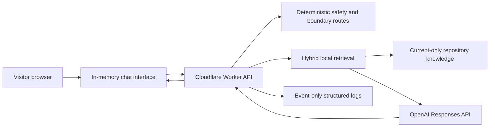

# MentorSphere Assistant Phase 1

## Outcome

Phase 1 adds an optional floating website assistant that answers only from approved MentorSphere information. It is not a general assistant. The production feature flag is off by default and no deployment is part of this change set.

The implementation includes:

- A responsive, keyboard-accessible chat interface loaded through the existing shared site script.
- A Cloudflare Worker endpoint at `/api/assistant/chat`.
- A repository-controlled TypeScript knowledge base with current, excluded and time-limited records.
- Hybrid retrieval using terminology groups, typo correction, exact phrase and keyword scoring, concept tags and fuzzy similarity.
- Short model generation over only the best retrieved entries.
- Deterministic emergency, safeguarding, confidential-document, medical, diagnostic, legal, prompt-injection and unrelated-query responses.
- Current-session context held only in JavaScript memory.
- Verified source links selected by the server, not by the model.
- Event-only analytics logs with no visitor message text.
- Automated tests, content validation and manual review checklists.

## Architecture

The Cloudflare Worker also serves the existing static `docs/` site. `run_worker_first` is limited to `/api/assistant/*`, so static asset delivery stays with the Workers Assets binding. No external vector database, database or transcript store is used.

The retrieval layer is semantic at the controlled concept level. Visitor language such as `home schooling`, `SEN help`, `ADHD therapy`, `work pay` and `trial lesson` expands into approved MentorSphere concepts before ranking. Exact keywords and phrases receive additional weight for prices, ages, policy names and notice periods. Fuzzy trigram similarity handles short spelling mistakes. The model does not perform source selection.

## Provider and model

The configured provider is OpenAI through the server-side Responses API. The pinned default is `gpt-5.4-nano-2026-03-17`, selected for a narrow, retrieval-grounded, cost-sensitive text task. It supports the Responses API and structured instruction following at a lower token price than larger models. No web-search, file-search or other model tools are enabled.

Current model and price references used for this implementation:

- [GPT-5.4 nano model page](https://developers.openai.com/api/docs/models/gpt-5.4-nano)
- [OpenAI API data controls](https://developers.openai.com/api/docs/guides/your-data)
- [Cloudflare Workers rate limiting](https://developers.cloudflare.com/workers/runtime-apis/bindings/rate-limit/)

Any paid provider use requires owner approval before a public staging or production release.

## Environment variables and secrets

| Name | Type | Purpose |
| --- | --- | --- |
| `CHATBOT_ENABLED` | Non-secret variable | `true` shows and enables the assistant; any other value disables chat. Production defaults to `false`. |
| `AI_PROVIDER` | Non-secret variable | Must be `openai` in Phase 1. |
| `AI_MODEL` | Non-secret variable | Pinned model ID. |
| `ENVIRONMENT` | Non-secret variable | Structured-log environment label. |
| `OPENAI_API_KEY` | Secret | Server-side provider credential. |
| `OPENAI_PROJECT_ID` | Optional secret | Restricts requests to a selected OpenAI project. |

Use `.dev.vars.example` as the local template. Never add `.dev.vars` or an API key to Git.

## Knowledge-base maintenance

The source is [knowledge-base.ts](../../src/assistant/knowledge-base.ts). Each entry includes:

- `id`
- `title`
- `category`
- `content`
- `sourcePage`
- `sourceUrl`
- `documentVersion`
- `effectiveDate`
- `lastReviewed`
- `keywords`
- `alternativeTerms`
- `concepts`
- `status`
- `priority`
- optional `validUntil`

Only `current` entries whose date window is active are retrievable.

To add or update an answer:

1. Confirm the wording against the approved source hierarchy.
2. Update the canonical public page or policy first when that is the owner-approved change.
3. Edit the matching knowledge entry. Keep exact prices, ages, deadlines and limits verbatim.
4. Update `documentVersion`, `effectiveDate` and `lastReviewed`.
5. Add visitor language to `alternativeTerms` or the shared terminology map only when it maps clearly to that approved concept.
6. Add or update an automated retrieval test.
7. Run `pnpm check`.

To archive a source, change its status to `archived`. Do not delete it merely to hide a conflict. For temporary wording, use `validUntil`; the existing-client ADHD price transition automatically stops being retrievable after 31 August 2026.

There is no separate hosted index to refresh. TypeScript bundling rebuilds the retrieval index whenever Wrangler builds or deploys the Worker.

## Privacy-first analytics

The Worker logs only controlled event names, request IDs, environment and source counts. Allowed browser events are:

- `chat_opened`
- `message_sent`
- `fallback_triggered`
- `source_link_clicked`
- `helpful_yes`
- `helpful_no`
- `technical_error`

Visitor text is never included. Failed-answer review can therefore identify fallback volume and technical error rates, but it cannot reveal what the visitor asked. Improving an unknown failed query requires voluntary, separate feedback through the contact route or a later owner-approved privacy design.

## Cost control and estimate

Controls include four retrieved entries at most, six recent messages at most in the model prompt, a 320-token output cap, no model tools, no embeddings API, no vector database, deterministic fallbacks before model use and a Cloudflare rate-limit binding configured for 12 calls per 60 seconds for each session key within each Cloudflare location.

Cloudflare documents this binding as permissive and eventually consistent. It is local to the Cloudflare location serving the request and is not an exact accounting system. It must not be tested by requiring request 13 to return `429`. A staging observation on 30 July 2026 sent 80 sequential deterministic requests using one synthetic session ID. Requests 1 to 13 returned `200`, request 14 was the first `429`, and requests 14 to 80 remained rate-limited.

For Phase 1, this approximate edge limit is proportionate when combined with the owner-controlled OpenAI project spend limit, the 600-character message limit, the 3,000-character conversation limit, the 320-token output cap, the 12-second provider timeout, the pinned low-cost model and the absence of model tools. A stricter stateful limiter is not currently recommended. Durable Objects, KV, D1 or another stateful service would add architecture, processing and cost that requires separate owner approval.

Estimate assumptions:

- Three model-backed turns per conversation.
- 1,500 input tokens and 120 output tokens per turn.
- 4,500 input tokens and 360 output tokens per conversation.
- GPT-5.4 nano standard pricing used on 30 July 2026: US$0.20 per million input tokens and US$1.25 per million output tokens.
- Cloudflare, tax, currency conversion, retry traffic and any future regional-processing uplift are excluded.

Calculation:

`(4,500 / 1,000,000 × $0.20) + (360 / 1,000,000 × $1.25) = $0.00135 per conversation`

| Conversations | Estimated model cost |
| ---: | ---: |
| 100 | US$0.14 |
| 1,000 | US$1.35 |
| 10,000 | US$13.50 |

Actual cost must be monitored from provider usage because message length, cache behaviour, retries and conversation length vary.

## Quick disable and rollback

Fastest disable:

1. Set `CHATBOT_ENABLED` to `false` for the affected Cloudflare environment.
2. Deploy that configuration.
3. Confirm `/api/assistant/config` returns `"enabled": false` and the launcher is absent.

This stops new chat requests without deleting code. For a full rollback, use Cloudflare Worker version rollback or revert the Phase 1 commit and deploy the reviewed prior version. Do not alter the custom domain, DNS or Pages settings.

## Known limitations and Phase 2 possibilities

- No file uploads, document review, client-record access, booking access, email access or memory between visits.
- No live internet search.
- No raw transcript analytics.
- Session-token rate limiting is deliberately privacy-preserving, location-local and approximate. A determined automated client can reset the browser-generated session ID. A Cloudflare WAF rule or Turnstile challenge could add stronger abuse resistance after owner and privacy review.
- Live provider responses have been tested only in the owner-approved staging environment. Production remains disabled and untested.
- Retrieval quality must be rechecked whenever prices, policies or service scope change.
- Possible Phase 2 work includes an owner-only failed-query review workflow with explicit consent, a policy-source build pipeline, multilingual evaluation, and carefully governed secure document intake. None of these are current services or Phase 1 features.
